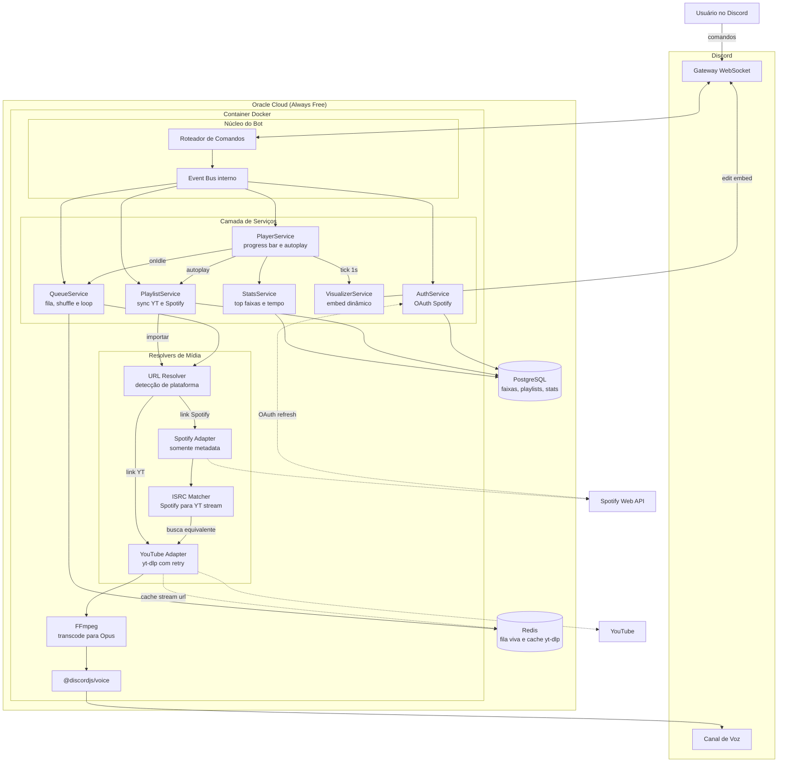
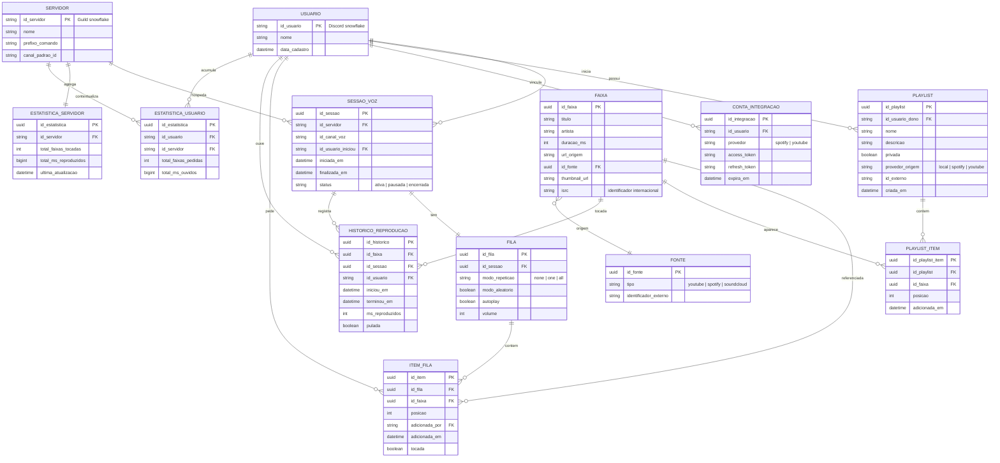
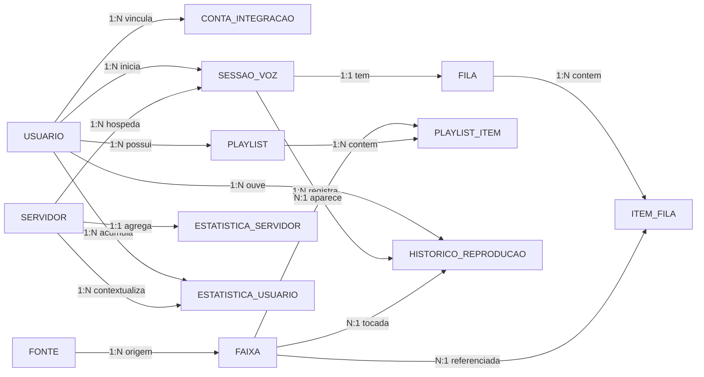

# Cabecinha Bot

Bot de música para Discord escrito em Node.js, com foco em streaming resiliente, fila persistente, integração multi-plataforma (YouTube + Spotify) e deploy containerizado em nuvem.

<p align="left">
  
  
  
  
  
  
  
  
  
  
</p>

---

## Sobre o projeto

Cabecinha Bot nasceu como um experimento pessoal de streaming de áudio em tempo real via WebSocket no Discord e evoluiu para um estudo prático de arquitetura de serviços, modelagem de dados e deploy em nuvem.

O projeto explora:

- Streaming de áudio com `@discordjs/voice` e `ffmpeg`
- Extração resiliente de mídia com `yt-dlp` (substituto do `ytdl-core`)
- Containerização com Docker para isolamento e portabilidade
- Deploy em nuvem com Oracle Cloud (Always Free)
- Integração OAuth 2.0 com APIs externas (Spotify Web API)
- Modelagem relacional com PostgreSQL e cache transacional em Redis
- Telemetria de uso e estatísticas agregadas

---

## Status atual

| Funcionalidade           | Estado            |
| ------------------------ | ----------------- |
| Play / Pause / Resume    | Implementado      |
| Stop / Disconnect        | Implementado      |
| Fila de músicas          | Em desenvolvimento|
| Autoplay                 | Em desenvolvimento|
| Visualizer com progress bar | Em desenvolvimento|
| Integração Spotify (OAuth)  | Planejado      |
| Importação de playlists (YT/Spotify) | Planejado |
| Estatísticas agregadas   | Planejado         |
| Deploy em produção       | Planejado         |

---

## Stack técnica

| Camada           | Tecnologia                                    |
| ---------------- | --------------------------------------------- |
| Runtime          | Node.js 22                                    |
| Bot framework    | discord.js v14 + @discordjs/voice             |
| Extração de mídia| yt-dlp (via `yt-dlp-exec`)                    |
| Transcoding      | FFmpeg (`ffmpeg-static`)                      |
| Persistência     | PostgreSQL                                    |
| Cache / fila     | Redis                                         |
| Empacotamento    | Docker                                        |
| Hospedagem       | Oracle Cloud (VM Ampere ARM / Always Free)    |

---

## Executando localmente

### Pré-requisitos

- Node.js 22 ou superior
- Python 3 (dependência interna do `yt-dlp`)
- FFmpeg (fornecido via `ffmpeg-static`, não requer instalação manual)

### Passos

```bash
git clone https://github.com/<seu-user>/botmusic-cabecinha.git
cd botmusic-cabecinha

npm install

cp .env.example .env
# Edite o .env e preencha DISCORD_TOKEN

node cabecinhabot.js
```

### Executando via Docker

```bash
docker build -t cabecinha .
docker run --env-file .env cabecinha
```

---

## Comandos disponíveis

| Comando               | Descrição                                  |
| --------------------- | ------------------------------------------ |
| `~play <url>`         | Reproduz áudio a partir de uma URL do YouTube |
| `~pause`              | Pausa a reprodução                         |
| `~resume`             | Retoma a reprodução                        |
| `~stop`               | Interrompe a faixa atual                   |
| `~disconnect` / `~dc` | Desconecta o bot do canal de voz           |
| `~help`               | Exibe a lista de comandos                  |

O comando de desconexão exige que o solicitante esteja no mesmo canal de voz que o bot, como medida básica de controle de acesso.

---

## Arquitetura

Visão lógica dos componentes e do fluxo de dados quando uma requisição de reprodução é processada:



### Decisões de arquitetura

- **`yt-dlp` em vez de `ytdl-core`**: o YouTube quebra a compatibilidade do `ytdl-core` com frequência. O `yt-dlp` apresenta resiliência significativamente maior, ao custo da dependência de Python no runtime.
- **Spotify apenas para metadata**: a Web API do Spotify não permite streaming de áudio. O fluxo correto é obter metadados (título, artista, ISRC) no Spotify e localizar a faixa equivalente no YouTube via matcher. Esse é o padrão adotado pela maioria dos bots de música.
- **Redis como camada de fila e cache**: a fila opera em memória, mas precisa sobreviver a reinícios de container. Redis oferece persistência leve e TTL nativo, ideal para cachear URLs de stream do `yt-dlp` (que expiram).
- **VM dedicada em vez de serverless**: bots de música mantêm conexões WebSocket persistentes e processos de longa duração, o que torna soluções como AWS Lambda ou Cloud Run inadequadas. Uma VM Ampere ARM do Oracle Always Free atende ao perfil com folga.

---

## Modelagem de dados

### Modelo Entidade-Relacionamento (MER)

A modelagem desacopla a entidade `FAIXA` da entidade `FONTE` para resolver o cenário de crossover Spotify ↔ YouTube. A mesma faixa pode ter registros em múltiplas fontes e ser correlacionada por ISRC, garantindo deduplicação semântica.



### Dicionário de entidades

| Entidade               | Responsabilidade                                                  |
| ---------------------- | ----------------------------------------------------------------- |
| `USUARIO`              | Identifica solicitantes de reprodução, donos de playlists e tokens OAuth |
| `SERVIDOR`             | Representa uma guild do Discord com configurações próprias        |
| `CONTA_INTEGRACAO`     | Armazena credenciais OAuth de provedores externos (Spotify)       |
| `SESSAO_VOZ`           | Modela uma sessão ativa do bot em um canal de voz                 |
| `FILA` / `ITEM_FILA`   | Fila volátil de reprodução vinculada a uma sessão                 |
| `FAIXA`                | Entidade canônica de música, agnóstica de fonte                   |
| `FONTE`                | Referência à origem externa (YouTube, Spotify, SoundCloud)        |
| `PLAYLIST`             | Coleção persistente, podendo espelhar provedores externos         |
| `HISTORICO_REPRODUCAO` | Registro de auditoria e fonte primária para agregações estatísticas |
| `ESTATISTICA_*`        | Views materializadas para consultas analíticas de baixa latência  |

### Diagrama Entidade-Relacionamento (DER) — visão lógica



---

## Deploy em produção

### Oracle Cloud Infrastructure (Always Free)

A camada **Always Free** do Oracle Cloud oferece, sem prazo de expiração, até **4 vCPUs ARM Ampere A1 e 24 GB de RAM** distribuíveis em uma ou mais VMs, além de 200 GB de armazenamento em bloco e 10 TB de tráfego de saída mensal. O perfil de carga do bot — processo único de longa duração com pico de CPU apenas durante o transcoding via FFmpeg — opera com folga significativa nesse envelope de recursos.

Roteiro resumido:

1. Provisionar uma VM `VM.Standard.A1.Flex` (Ampere ARM) com Ubuntu 22.04 ou Oracle Linux
2. Configurar regras de ingress no Security List (apenas SSH é necessário para o bot)
3. Instalar Docker e Docker Compose na instância
4. Carregar as variáveis de ambiente via arquivo `.env`
5. Executar o container com política `restart=always` para resiliência a reboots
6. Opcional: configurar Watchtower para atualização automática da imagem

### Alternativas

Caso o Oracle Cloud não seja viável por região ou disponibilidade de quota ARM, alternativas equivalentes:

- **Google Cloud Free Tier**: instância `e2-micro` em regiões dos EUA, perpetuamente gratuita
- **AWS EC2 Free Tier**: `t2.micro` com 750 horas mensais durante os primeiros 12 meses
- **Fly.io**: camada gratuita compatível com containers Docker, com limites de recurso

---

## Roadmap

- [ ] Refatoração para arquitetura modular (services + adapters)
- [ ] Fila persistente de músicas (`~queue`, `~skip`, `~clear`)
- [ ] Visualizer com progress bar via edição de embed
- [ ] Autoplay com fallback para playlist ativa
- [ ] Retry policy resiliente no `yt-dlp`
- [ ] Integração Spotify via OAuth 2.0
- [ ] Importação de playlists do YouTube e Spotify
- [ ] Dashboard de estatísticas agregadas por servidor e usuário
- [ ] Dockerfile multi-stage com `docker-compose` (Postgres + Redis)
- [ ] Deploy automatizado no Oracle Cloud com systemd e Watchtower

---

## Contribuindo

Este é um projeto de portfólio pessoal, mas contribuições são bem-vindas. Diretrizes mínimas:

- Nunca versione arquivos de configuração com segredos (use `.env.example`)
- Mantenha mensagens de commit descritivas e atômicas
- Abra uma issue antes de propor mudanças estruturais significativas

---

## Licença

Distribuído sob a licença ISC. Consulte o arquivo `LICENSE` para detalhes.

---

Desenvolvido por [Daniel Furtado](https://github.com/).
